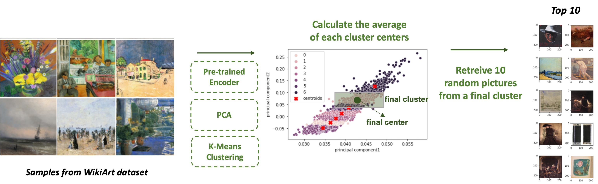

# Artwork-Recommendation
We present an Artwork Recommendation System that provides new artworks based on a visual clustering technique and user preferences, developed with sampled artworks from WikiArt datasets. The purpose of the development of this Recommendation System is to verify whether a user's satisfaction increases when presented with artwork close to his or her taste. We also conducted a within-subjects experiment to validate the effect of preference-based recommendation on a user's satisfaction with the recommended artwork sets.


## Workflow of our study
<p align="center">
<br>
<em> Figure : From data collection to Recommendation </em>
</p>


## Data
The list of our sampled artworks used for the Experiment is _total_dataset in ```data``` folder. Picture files for artworks in the list can be downloaded [here](https://github.com/cs-chan/ArtGAN/tree/master/WikiArt%20Dataset).
The table below shows the number of artworks for each art style used for the experiment.

|  Art Style                 |   # of Artwork |
|:---------------------------|---------------:|
| Impressionism              |         13,060 |
| Baroque                    |          4,241 |
| Cubism                     |          2,225 |
| Color Field Painting       |          1,573 |
| Pop Art                    |          1,483 |
| High Renaissance           |          1,343 |
| Minimalism                 |          1,337 |
| Ukiyo - e                  |          1,167 |
| New Realism                |            314 |
| Action Painting            |             98 |


## Experiment
The experiment was conducted on 42 university students recruited from one of the large private universities in Seoul, Korea.
We developed a website that collects real-time user preferences on the presented artwork.
The participants were asked to select 'like' or 'dislike' on 20 random artworks presented and after the selection was done, the website made recommendation sets(MRS procedure). Then, participants were represented with two sets of artwork, the first set was extracted from a cluster that was the closest to the artwork each user liked. The second set was selected from another cluster, which was the farthest from a group of artwork that the user liked.

<p align="center">
<br>
<em> Figure : The experiment website (written in Korean) </em>
</p>


